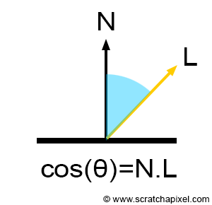
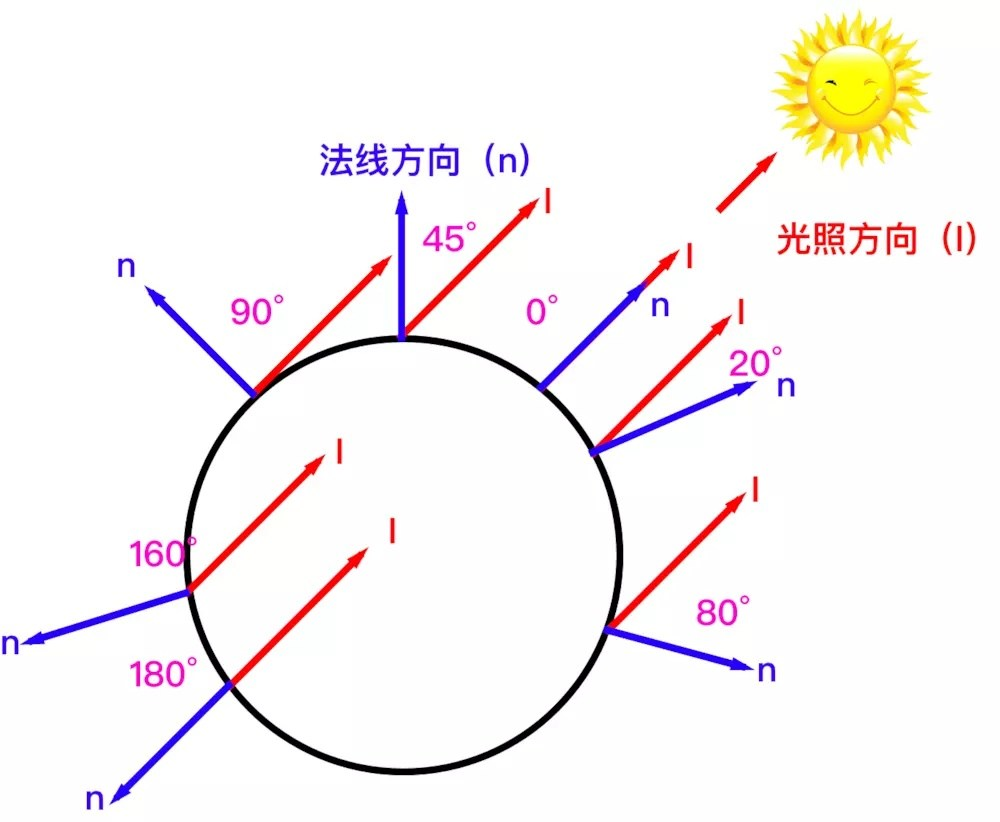
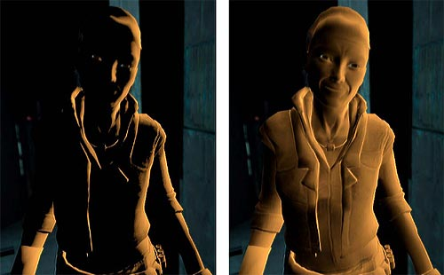

## Lambert光照模型

由**Lambert**提出的一种简单的光照模型，提出了漫反射的计算方式

**Lambert余弦定理**：反射光线的强度与表面法线和光源之间夹角的余弦成正比`$I_{r} = I_{l}\cdot\cos\theta$`

## 漫反射计算

`$$C_{diffuse} = M_{diffuse} \cdot C_{light} \cdot max(0, \vec{n} \cdot \vec{l})$$`

---

---

## 半Lambert光照模型

由Valve公司在研发游戏《Half Life》时发明的，用来解决物体背光面没有任何光照强度，导致图像太黑，丢失几何信息

---

`$$C_{diffuse} = M_{diffuse} \cdot C_{light} \cdot (\alpha \cdot(\vec{n} \cdot \vec{l}) + \beta)$$`

`$\alpha$`和`$\beta$`的值通常都取`$0.5$`

半Lambert公式对`$\vec{n}\cdot\vec{l}$`的点积结果进行了偏移，使得其范围从`$[-1,1]$`映射到`$[0,1]$`，不再出现负数
