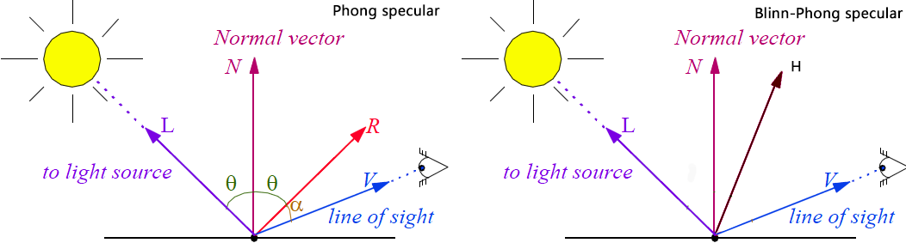

## 冯式（Phong）光照模型

由越南裔美国科学家**裴祥风**于1975年提出的一种光照模型

其首次在光照模型中提出了高光镜面反射的经验计算方法

---

## 高光反射

表面法线`$n$`, 视角方向`$v$`, 光源方向`$l$`, 反射方向`$r$`, 材质高光系数`$m_{gloss}$`

其计算公式为

`$$C_{specular} = (M_{specular} \cdot C_{light})^{max(0, \vec{v}\cdot\vec{r})^{m_{gloss}}}$$`

---

## Blinn-Phong光照模型

1977年Blinn在Phone模型的基础上，对其提出了简单的修改，简化了Phone模型的计算，提高了效率

Blinn引入了一个新的矢量`$\vec{h}$`，该矢量由`$\vec{n}$`和`$\vec{l}$`取平均后标准化得到

`$$\vec{h} = {{\vec{v} + \vec{l}} \over {|{\vec{n} + \vec{l}}|}}$$`

---

## Blinn-Phong计算公式

`$$C_{specular} = (M_{specular} \cdot C_{light})^{max(0, \vec{n}\cdot\vec{h})^{m_{gloss}}}$$`
